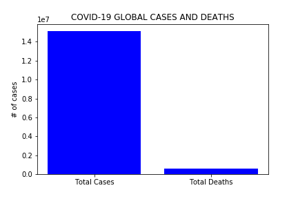
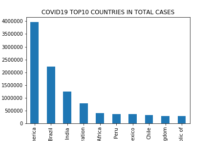
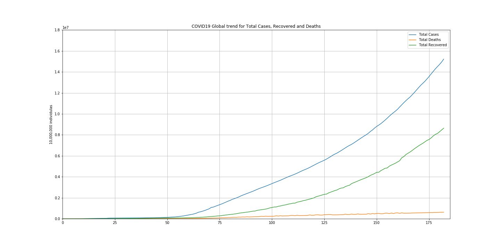

# Project title: Closer look at the pandemics

Team members:
- Fariha Siddiqui
- Nazila Entezari
- Ying Feng

Questions we will be exploring:
 - What is the rate of increase in total cases for the pandemics? 
 - What is the death rate and how does it compare to the total cases?
 - How many countries are impacted? 
 - Are there any geographical similarities between the two pandemics?
 - What are some further impacts of Covid-19? 

### 1.	What is the rate of increase in total cases for the pandemics? 

 

 

Covid-19’s total cases increase at a greater rate than H1N1. The rate of increase for Covid-19 is 77,883 and H1NI is 1,429.

### 2.	What is the death rate and how does it compare to the total cases?

 
 

Pandemics | Total Global Cases | Total Deaths | Death Rate 
----------|--------------------|--------------|-----------
H1N1      | 94,577             | 429          | 0.45%
Covid-19. | 14,416,267         | 602,837      | 4.18%

Death rate for Covid -19 is 4.18% which is higher than H1N1’s death rate of 0.45%.

### 3.	How many countries are impacted? 

H1N1:
 

Covid-19:
 

95% of the world was impacted by Covid-19 whereas 75% of the world was impacted by H1N1.

### 4.	Are there any geographical similarities between the two pandemics?

H1N1:

 
 

Covid19:

 
 

 
 

- The correlation coefficient for H1N1 of total cases vs. total deaths is 0.893 and for covid-19 it is 0.93.
- Most of the countries show up in both total cases and total death charts.
- For both pandemics, the total deaths is positively and significantly correlated to the total cases. USA is the top country for both pandemics in total cases and total deaths. 

### 5.	What are some further impacts of Covid-19? 

- Closer look at COVID19:
Following our analysis we now know that covid19 is incomparably more severe, widespread and prolonged than H1N1. That’s why we wanted to take a deeper look into it
 

Since it is a pandemic we started with the trends for three parameters which are total cases, total recovered and total deaths globally.
Visually we can see that the three have a positive correlation  and we approved it by calculating the correlation coefficient which for both recovered vs total cases and deaths vs total cases  was significantly high, more than 0.9.
 

The global death rate for COVID19 proved to be %4.18 globally.
looking into the top10 most affected countries for the same, we found that although the US has the highest total cases and deaths,  death rate prove to be 3.7 which is lower than the global rate; Whereas South Africa and some south American countries have relatively higher death rates, which can be a proof of weaker healthcare system.

##### Covid-19 number of cases prediction by Regression

 

- Regression value = 77883.91x - 3079120.17
- The predicted number of deaths globally by the end of year 2020 based on our 2nd degree nonlinear regression will be 24,684,370

 

- Regression Value = 0.86x3 + 372.05x2 -16816.07x +114054.0
- The predicted number of deaths globally by the end of year 2020 based on our 3rd degree nonlinear regression will be 85,137,099 following the current trend.

Since COVID19 is still ongoing and no prospective cure or vaccine is available now, we tried some mathematical modelling from our 7 months of data we already have, to predict possible future impact of the disease if nothing changes.
We made a linear regression on the total no of cases, that can predict 24 million cass
As we can see on the first graph the linear regression is not the best fit to our data, so we tried some more advanced nonlinear ones, like logarithmic but we found out a 3rd grade nonlinear equation would fit our total cases data best. The prediction show that if nothing changes ie. no vaccine or cure is out there, by the end of the year more than 85 million people will be infected by the virus.

##### Covid-19 number of deaths prediction by Regression

 

- Regression Value = 3920.77x-134954.79
- The predicted number of deaths globally by the end of year 2020 based on our linear regression will be 1,289,590

 

- Regression Value = 17.12 x2 + 800.48x - 39646.33
- The predicted number of deaths globally by the end of year 2020 based on our 2nd degree nonlinear regression will be 2,533,394 if the current trend persists.
- Our predictions show a death rate of around 3% relatively close to our current death rate.

We tried the same approach for the number of global deaths, but only this time we found a 2nd grade nonlinear regression to best fit our data, and which enables us to further predict. With the latter our prediction for number of deaths by the end of the year 2020 caused by COVID19 will be around 2,500,000 people.
We also tested our predictions for consistency with our current data. Our predicted death rate stays around 3% which is relatively close to our current death rate.

